# ⚡ Comprehensive System Analysis & Financial Flow Breakdown Report
### Online Trading Platform & Digital Asset Settlement (Gold Trading & Settlement Platform)

---

## 📑 Table of Contents
1. [System Overview and Architecture](#1-system-overview-and-architecture)
2. [Layered Architecture and Module Standards](#2-layered-architecture-and-module-standards)
3. [Authentication and Two-Factor Login Flow](#3-authentication-and-two-factor-login-flow)
4. [Customer KYC State Machine & Flow](#4-customer-kyc-state-machine--flow)
5. [Bank Card Verification Flow](#5-bank-card-verification-flow)
6. [Buy Gold from Wallet Flow](#6-buy-gold-from-wallet-flow)
7. [Buy Gold via Zarinpal Payment Gateway Flow](#7-buy-gold-via-zarinpal-payment-gateway-flow)
8. [Direct Rial Wallet Deposit Flow](#8-direct-rial-wallet-deposit-flow)
9. [Sell Gold and Settle to Wallet Flow](#9-sell-gold-and-settle-to-wallet-flow)
10. [Sell Gold with Direct Settlement to Bank Card Flow](#10-sell-gold-with-direct-settlement-to-bank-card-flow)
11. [Complete Withdrawal and Vandar Paya Settlement Flow](#11-complete-withdrawal-and-vandar-paya-settlement-flow)
12. [Idempotency and Concurrency Engine](#12-idempotency-and-concurrency-engine)
13. [Safety Nets and Periodic Reconciliation Workers](#13-safety-nets-and-periodic-reconciliation-workers)
14. [Test Status and Software Quality](#14-test-status-and-software-quality)
15. [Final Assessment and Project Technical Rating](#15-final-assessment-and-project-technical-rating)

---

## 1. System Overview and Architecture

The project is designed based on a **Clean / Layered Architecture** on top of Django 5.2 and DRF. None of the layers have direct access to the database, and responsibilities are precisely divided among the API layer, services (business logic), selectors (read queries), and models.

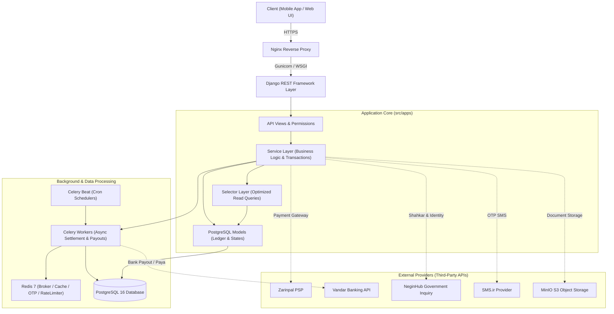

---

## 2. Layered Architecture and Module Standards

The folder structure across all modules (`accounts`, `customers`, `exchange`, `payments`, `settlements`, `notifications`, `site_setting`) follows the pattern below:

```
src/apps/<module_name>/
├── api/
│   ├── views/          # HTTP controllers and input validation
│   ├── serializers/    # DRF input and output serializers
│   └── permissions/    # User role permissions and guards
├── services/           # Operational logic, database changes, and atomic transactions (CUD)
├── selectors/          # Read-only data retrieval functions and queries with no side effects
├── models/             # Database table structures and indexes
├── tasks/              # Asynchronous Celery tasks
├── exceptions/         # Domain-specific exceptions
├── signals/            # Internal system signals
└── tests/              # Unit, integration, and concurrency tests
```

---

## 3. Authentication and Two-Factor Login Flow

Login is based on mobile phone number and a one-time password (OTP) with a 120-second time limit in Redis. If 2FA is enabled, the TOTP token is also verified.

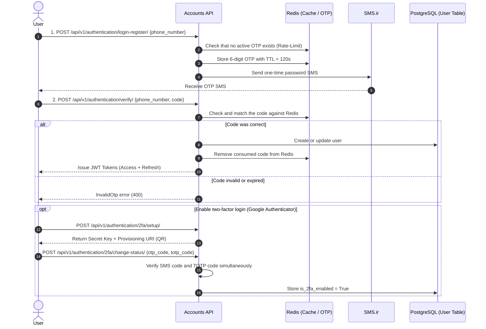

---

## 4. Customer KYC State Machine & Flow

The KYC process is carried out in 5 strict stages to verify the account holder's identity:

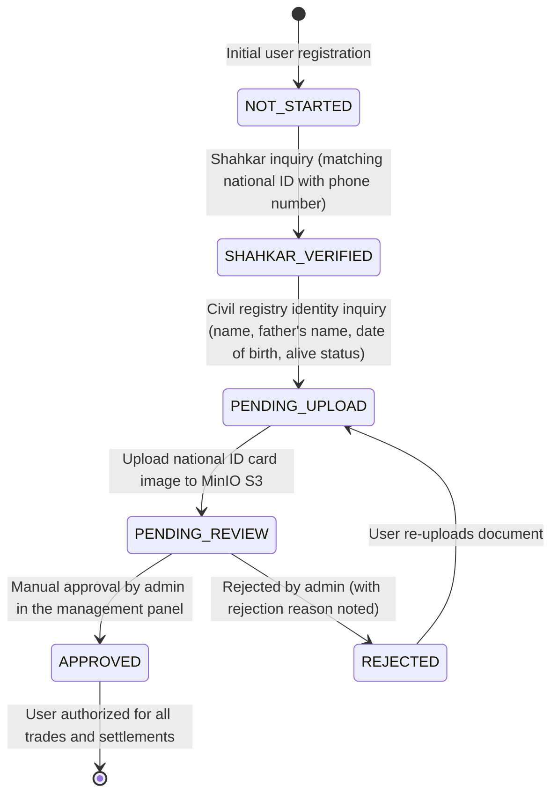

---

## 5. Bank Card Verification Flow

Customer bank cards must be automatically matched against their national ID, and the IBAN (Sheba) number and bank name must be retrieved:

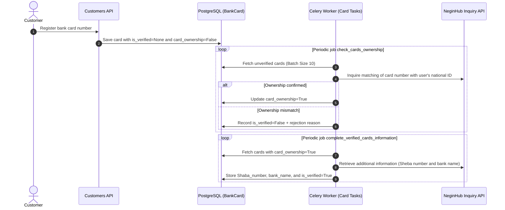

---

## 6. Buy Gold from Wallet Flow

In this method, the user purchases gold (XAU18) using the balance of their rial (IRT) wallet:

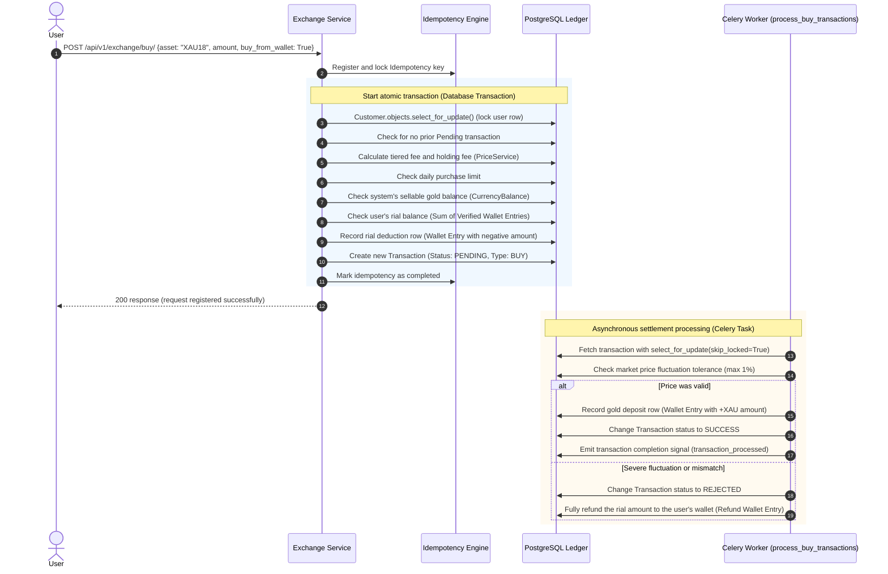

---

## 7. Buy Gold via Zarinpal Payment Gateway Flow

In this method, the user connects directly to the Zarinpal payment gateway without having a rial balance:

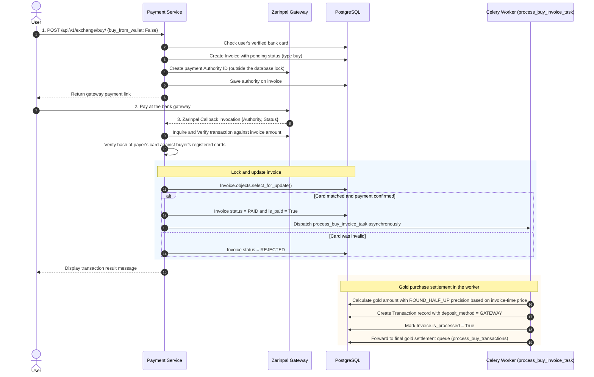

---

## 8. Direct Rial Wallet Deposit Flow

The user first tops up their rial wallet via the gateway in order to trade later:

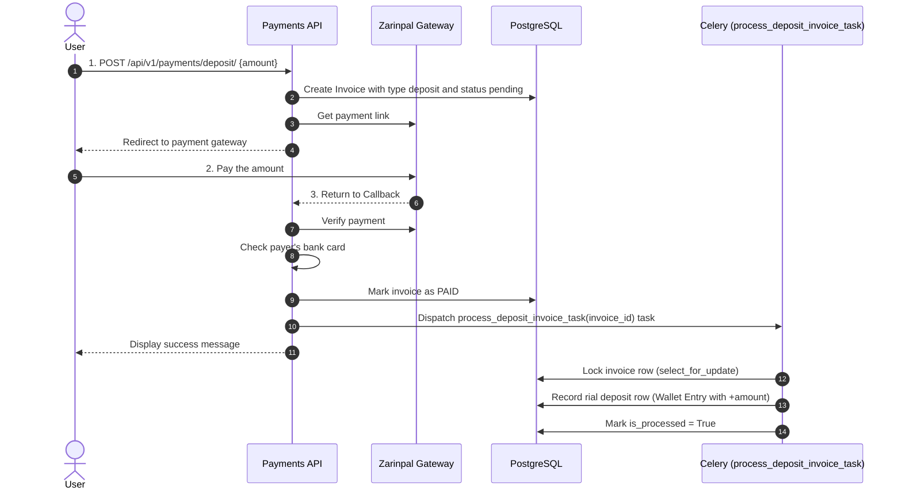

---

## 9. Sell Gold and Settle to Wallet Flow

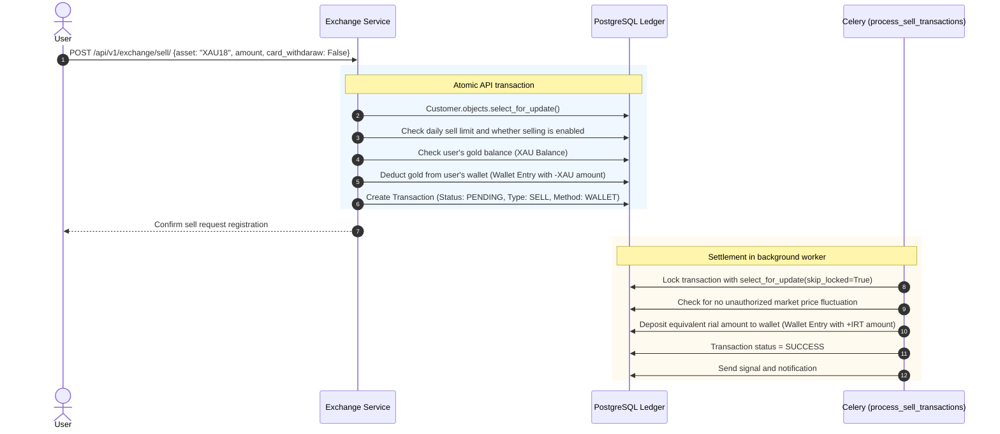

---

## 10. Sell Gold with Direct Settlement to Bank Card Flow

In this case, the user sells their gold and requests that the amount be settled (Paya) directly to their bank account:

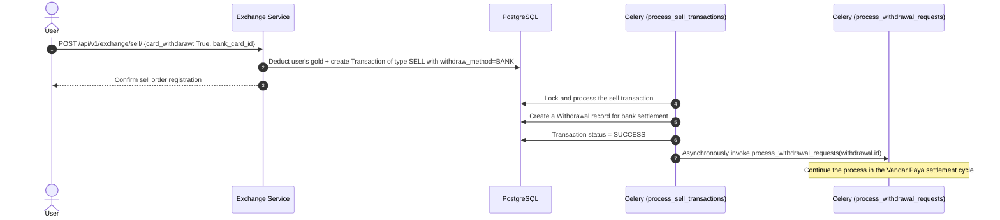

---

## 11. Complete Withdrawal and Vandar Paya Settlement Flow

Bank settlement requires managing complex banking states (success, failure, network error, Paya cycle delay):

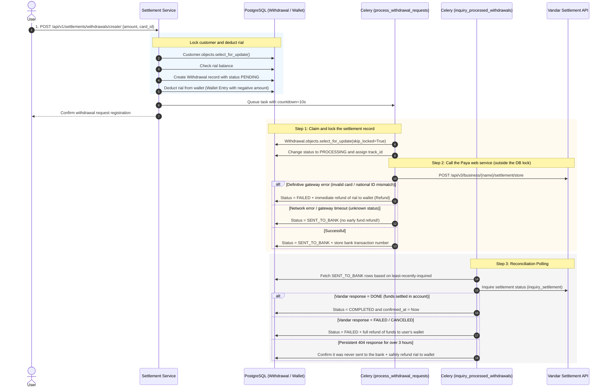

---

## 12. Idempotency and Concurrency Engine

To ensure that no financial request is executed twice under network retry conditions or double-clicks, the idempotency core (`IdempotencyService`) has been designed:

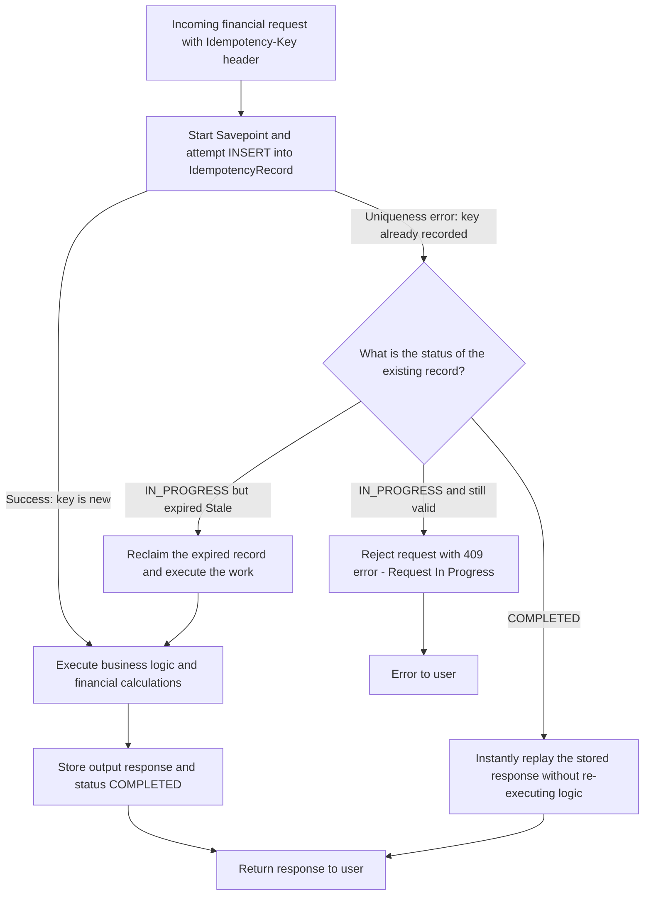

---

## 13. Safety Nets and Periodic Reconciliation Workers

The system is equipped with scheduled Celery Beat jobs to contain exceptions and unexpected infrastructure errors:

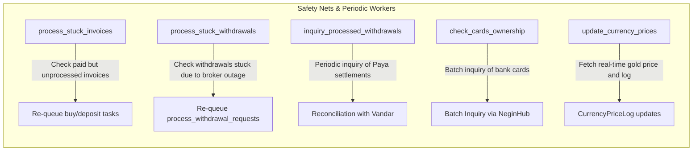
